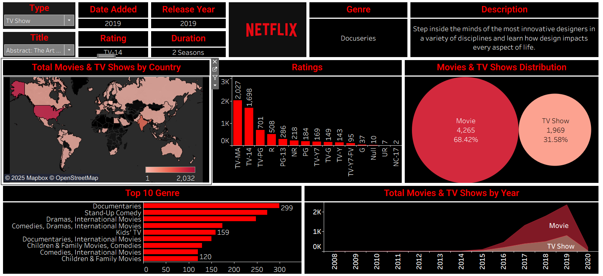

# Netflix Movies & TV Shows Tableau Dashboard

This repository contains an interactive Tableau dashboard analyzing Netflix Movies and TV Shows.
The goal of this project is to explore trends, ratings, genre distribution, country availability, and yearly content releases.

---

## Dashboard Preview



---

## Project Structure

```
netflix-dashboard/
│
├── data/
│   └── netflix_titles.csv
│
├── tableau/
│   ├── Netflix_Dashboard.twb
│   └── Netflix_Dashboard.hyper   # optional
│
├── images/
│   └── dashboard_preview.png
│
├── README.md
└── .gitignore
```

---

## Dashboard Sections

The Tableau dashboard includes the following:

### **1️. Filters**

* Type
* Title
* Date Added
* Release Year
* Rating
* Duration
* Genre

### **2️. Visualizations**

* Geographic distribution of Netflix content
* Ratings distribution (bar chart)
* Movie vs TV Show distribution (packed bubbles)
* Top 10 genres (horizontal bar chart)
* Content added by year (area chart)

---

## Dataset

Source: **Netflix Titles Dataset**
Contains information such as:

* `type` (Movie / TV Show)
* `title`
* `director`, `cast`
* `country`
* `date_added`
* `release_year`
* `rating`
* `duration`
* `listed_in` (Genres)
* `description`

---

## How to Open

1. Install Tableau Public or Tableau Desktop
2. Clone this repository
3. Open:

```
tableau/Netflix_Analytics.twb
```

The workbook will load automatically.

---

## How to Contribute

Feel free to fork the repo and submit pull requests — improvements are welcome!

---

## License

MIT License.

